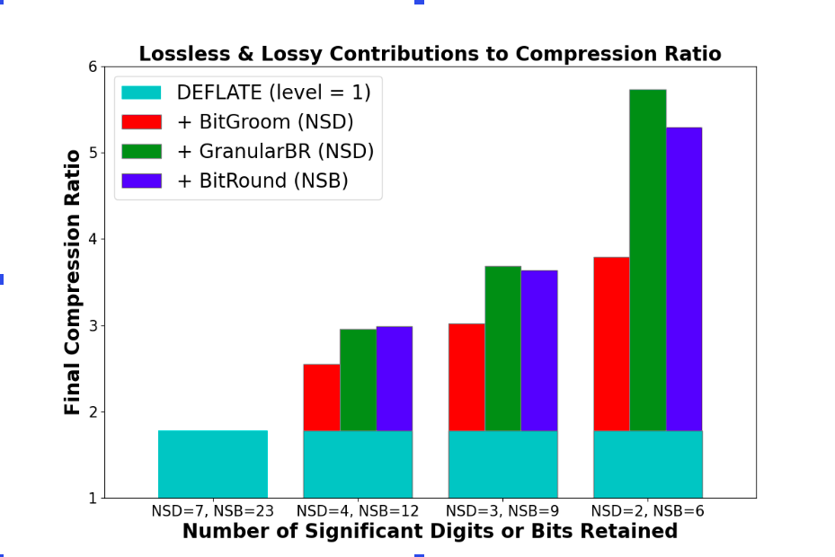

# Lossy Compression with Quantize

## Introduction {#quantize}

The quantize feature was initially developed as part of the Community
Codec Repository (CCR) [2]. The CCR project allows netCDF users to
make use of HDF5 plugins (a.k.a. “filters”) which can add new
compression and other algorithms to the HDF5 library. As part of CCR,
the quantization algorithms were implemented as HDF5 filters.

However, one aspect of implementing the quantization as a filter is
that the filter is also required when reading the data [1]. Although
this makes sense for compression/decompression algorithms, the
quantize algorithms are only needed when data are written. Requiring
that the readers of the data also install the filters places an
unnecessary burden on data readers. Furthermore, using the quantize
filter results in data that cannot be read by netCDF-Java or versions
of netcdf-c before 4.8.0, when support for multiple HDF5 filters was
added. For these reasons, it was decided to merge the quantize
algorithms into the netcdf-c library [5].

As part of the netcdf-c library, the quantize algorithms are available
for netCDF/HDF5 files, and the new ncZarr format, and produce data
files that are fully backward compatible for all versions of netcdf-c
since 4.0, and also fully compatible with netcdf-Java.

## The Quantize Feature

The quantize algorithms assist with lossy compression by setting
excess bits to all zeros or all ones (in alternate array values). This
allows a subsequent compression algorithm, like the zlib-based
deflation built into netCDF-4, to better compress the data.

The quantize feature is applied to a variable in a netCDF file, and
may only be used with single or double precision floating point
(netCDF types NC_FLOAT and NC_DOUBLE). Attempting to turn on quantize
for any other type of netCDF variable will result in an error.

It should be noted that turning on quantize does not, by itself,
reduce the size of the data. Only if subsequent compression is used
will setting the quantize feature result in additional compression.


Figure 1: The value of Pi expressed as a 32-bit floating point number,
with different levels of quantization applied, from Number of
Significant Digits equal to 8 (no quantization), to 1 (maximum
quantization). The least significant bits of the significand are
replaced with zeros, to the extent possible, while preserving the
desired number of significant digits. In this example the Bit Grooming
quantization algorithm is used.

## Quantization Algorithms

Three different quantization algorithms are provided in the netcdf-c
quantize feature. Each does a somewhat different calculation to
determine the number of bits that can be set to zeros (or ones), while
preserving the number of significant digits specified by the user.

Two of the algorithms, Bit-Groom and Granular Bit-Round, accept the
number of decimal digits to be preserved in the data. One algorithm,
Bit-Round, accepts the number of binary bits to preserve.

### Bit Grooming

The Bit Grooming algorithm sets determines the number of bits which
are necessary for the required number of significant decimal
digits. This determination is made at the beginning of processing and
is applied to all values.

Bit Grooming then sets excess bits of the first array value to zero,
then excess bits of the next array value to one, and continues
alternating between zero and one for the excess bits of every other
array value. In this way, the average value of the array is preserved.

For the Bit Grooming algorithm, the NSD parameter refers to the number
of significant decimal digits that will be preserved. The number of
significant digits may be 1-7 for single precision floating point, or
1-15 for double precision floating point.

### Granular Bit Round

Granular Bit Round determines the number of required bits for each
value in the array, and uses IEEE rounding to change the data
value. It achieves a better overall compression ratio by more
aggressively determining the minimum number of bits required to
preserve the specified number of decimal digit precision.

For the Granular Bit Round algorithm, the NSD parameter refers to the
number of significant decimal digits that will be preserved (as with
the Bit Grooming algorithm). The number of significant digits may be
1-7 for single precision floating point, or 1-15 for double precision
floating point.

### Bit Round

The Bit Round algorithm allows the user to directly specify the number
of bits of the significant which will be preserved, and then sets
excess bits to zero or one for alternate array values.

For the Bit Round algorithm, the NSD parameter refers to the number of
significant binary digits that will be preserved. The number of
significant digits may be 1-23 for single precision floating point, or
1-52 for double precision floating point.

## Quantize Attribute

When the quantize feature is used, an integer attribute is added to
the variable which contains the NSD setting. Without this attribute it
would be impossible for readers to know that quantize had been applied
to the data. The name of the attribute reflects the quantize algorithm
used. In accordance with the conventions established by the NetCDF
Users Guide, these attribute names begin with an underscore,
indicating that they are added by the library and should not be
modified or deleted by users [6].

Algorithm | Attribute Name
----------|---------------
Bit Groom | _QuantizeBitGroomNumberOfSignificantDigits
Granular Bit Round | _QuantizeGranularBitRoundNumberOfSignificantDigits
Bit Round | _QuantizeBitRoundNumberOfSignificantBits

Figure 2: Table showing the names of the attribute added to a variable
after the quantize feature has been applied. The name of the attribute
indicates the algorithm used, the integer values represents the number
of significant decimal digits (for Bit Groom and Granular Bit Round),
or the number of significand bits retained (for Bit Round).

## Handling of Fill Values

In a netCDF file, fill values refer to the value used for elements of
the data not written by the user. For example, if a variable contains
an array of 10 values, and the user only writes 8 of them, the other
two values will be set to the fill value for that variable.

The fill value of a variable may be set by the user by adding an
attribute of the same type as the variable with the name
“_FillValue”. If present, the value of this attribute will be used as
the fill value for that variable. If not specified, a default value
for each type is used as the fill value. The default fill values may
be found in the netcdf.h file.

When using the quantize feature, any fill values will remain
unquantized. That is, the excess bits of any array element will not be
changed, if that element is the fill value. This is necessary if the
fill value is to retain its purpose as an indicator of values that
have not been written.

## Distortions Introduced by Lossy Compression

Any lossy compression introduces distortions to data.
  
The Bitgroom algorithms implemented in netcdf-c introduce a distortoin
that can be quantified in terms of a _relative_ error. The magnitude
of distortion introduced to every single value V is guaranteed to be
within a certain fraction of V, expressed as 0.5 * V * 2**{-NSB}:
i.e. it is 0.5V for NSB=0, 0.25V for NSB=1, 0.125V for NSB=2 etc.
 
Two quantize algorithms use different definitions of _decimal
precision_, though both are guaranteed to reproduce NSD decimals when
printed.

The margin for a relative error introduced by the methods are
summarised in the table:

 ```
  NSD                   1        2        3       4       5        6      7 

  BitGroom   
  Error Margin      3.1e-2  3.9e-3   4.9e-4  3.1e-5  3.8e-6    4.7e-7     -

  GranularBitRound
  Error Margin      1.4e-1  1.9e-2   2.2e-3  1.4e-4  1.8e-5    2.2e-6     - 
   
 ```
 
If one defines decimal precision as in BitGroom, i.e. the introduced
relative error must not exceed half of the unit at the decimal place
NSD in the worst-case scenario, the following values of NSB should be
used for BitRound:

 ```
  NSD     1     2    3     4     5     6     7   
  NSB     3     6    9    13    16    19    23
 ```
 
The resulting application of BitRound is as fast as BitGroom, and is
free from artifacts in multipoint statistics introduced by BitGroom
(see https://doi.org/10.5194/gmd-14-377-2021).

## Using the Quantize Feature

Turning on the quantize feature must be done on a per-variable basis,
after the variable has been defined, and before nc_enddef() (or its
Fortran equivalents) have been called. (Recall that for netCDF/HDF5
files, nc_enddef() is automatically called when data are written or
read from a variable.)

In accordance with the usual NetCDF API practice, an inquiry function
is also provided which may be called to check if quantize has been
turned on for a variable. Calling the inquiry function is not required
when reading the data - it is provided for user convenience.

### Using Quantize with the NetCDF C API

Quantize is available in the main branch of the netcdf-c library, and
will be part of the next release (netcdf-c-4.9.0).

To turn on the quantize feature, call the nc_def_var_quantize()
function. To inquire about whether quantize been turned on for a
variable, use the nc_inq_var_quantize() function.

@code
        /* Create two variables, one float, one double. Quantization
         * may only be applied to floating point data. */
        if (nc_def_var(ncid, "var1", NC_FLOAT, NDIM1, &dimid, &varid1)) ERR;
        if (nc_def_var(ncid, "var2", NC_DOUBLE, NDIM1, &dimid, &varid2)) ERR;

        /* Set up quantization. This will not make the data any
         * smaller, unless compression is also turned on. In this
         * case, we will set 3 significant digits. */
        if (nc_def_var_quantize(ncid, varid1, NC_QUANTIZE_BITGROOM, NSD_3)) ERR;
        if (nc_def_var_quantize(ncid, varid2, NC_QUANTIZE_BITGROOM, NSD_3)) ERR;

        /* Set up zlib compression. This will work better because the
         * data are quantized, yielding a smaller output file. We will
         * set compression level to 1, which is usually the best
         * choice. */
        if (nc_def_var_deflate(ncid, varid1, 0, 1, 1)) ERR;
        if (nc_def_var_deflate(ncid, varid2, 0, 1, 1)) ERR;
@endcode

Figure 3: Example of using the quantize feature in C. Note that the
example also demonstrates adding zlib (a.k.a. deflate) compression to
the variables. Without turning on the compression, use of quantize
alone will not result in smaller data output.

### Using Quantize with the NetCDF Fortran 90 API

Quantize is available on a branch of the netcdf-fortran libraries, and
will be merged to main after the next netcdf-c release (4.9.0) and
will be released as part of the netCDF Fortran 90 API in the
subsequent release of netcdf-fortran.

In the Fortran 90 API, quantization is turned on by using two new
optional arguments to nf90_def_var(), the quantize_mode and the nsd
arguments.

@code
! Define some variables. 
  call check(nf90_def_var(ncid, VAR1_NAME, NF90_FLOAT, dimids, varid1&
       &, deflate_level = DEFLATE_LEVEL, quantize_mode =&
       & nf90_quantize_bitgroom, nsd = 3))
  call check(nf90_def_var(ncid, VAR2_NAME, NF90_DOUBLE, dimids,&
       & varid2, contiguous = .TRUE., quantize_mode =&
       & nf90_quantize_bitgroom, nsd = 3))
@endcode

Figure 4: In the Fortran 90 netCDF API, two additional optional
parameters are available for the quantize feature, the quantize_mode
and nsd parameters.

### Using Quantize with the NetCDF Fortran 77 API

Quantize is available on a branch of the netcdf-fortran libraries, and
will be merged to main after the next netcdf-c release (4.9.0) and
will be released as part of the netCDF Fortran 77 API in the
subsequent release of netcdf-fortran.

@code
C     Create some variables.
      do x = 1, NVARS      
          retval = nf_def_var(ncid, var_name(x), var_type(x), NDIM1,
     $         dimids, varid(x))
          if (retval .ne. nf_noerr) stop 3

C         Turn on quantize. 
          retval = nf_def_var_quantize(ncid, varid(x),
     $         NF_QUANTIZE_BITGROOM, NSD_3)
          if (retval .ne. nf_noerr) stop 3

C         Turn on zlib compression. 
          retval = nf_def_var_deflate(ncid, varid(x), 0, 1, 1)
          if (retval .ne. nf_noerr) stop 3
      end do
@endcode

Figure 4: In the Fortran 77 netCDF API, nf_def_var_quantize() and
nf_inq_var_quantize() are provided, which wrap the quantize functions
from the C API.

## Performance



Figure 5: Compression ratio of E3SM Atmosphere Model (EAM) v2 default
monthly dataset of raw size 445 MB compressed with default netCDF
lossless compression algorithm (DEFLATE, compression level=1) alone
(leftmost), or after pre-filtering with one of three lossy codecs
(BitGroom, Granular BitGroom, or BitRound) with quantization increasing
(and precision decreasing) to the right.

## References

1. HDF5 Dynamically Loaded Filters, The HDF Group, retrieved on
December 2, 2021 from
https://support.hdfgroup.org/HDF5/doc/Advanced/DynamicallyLoadedFilters/HDF5DynamicallyLoadedFilters.pdf.

2. Hartnett, Zender, C. S., (2020), ADDITIONAL NETCDF COMPRESSION
OPTIONS WITH THE COMMUNITY CODEC REPOSITORY (CCR), American
Meteorological Society (AMS) Annual Meeting, retrieved on July 3, 2021
from
https://www.researchgate.net/publication/347726695_ADDITIONAL_NETCDF_COMPRESSION_OPTIONS_WITH_THE_COMMUNITY_CODEC_REPOSITORY_CCR.

3. Zender, C. S. (2016), Bit Grooming: Statistically accurate
precision-preserving quantization with compression, evaluated in the
netCDF Operators (NCO, v4.4.8+), Geosci. Model Dev., 9, 3199-3211,
doi:10.5194/gmd-9-3199-2016 Retrieved on Sep 21, 2020 from
https://www.researchgate.net/publication/301575383_Bit_Grooming_Statistically_accurate_precision-preserving_quantization_with_compression_evaluated_in_the_netCDF_Operators_NCO_v448.

4. Delaunay, X., A. Courtois, and F. Gouillon (2019), Evaluation of
lossless and lossy algorithms for the compression of scientific
datasets in netCDF-4 or HDF5 files, Geosci. Model Dev., 12(9),
4099-4113, doi:10.5194/gmd-2018-250, retrieved on Sep 21, 2020 from
https://www.researchgate.net/publication/335987647_Evaluation_of_lossless_and_lossy_algorithms_for_the_compression_of_scientific_datasets_in_netCDF-4_or_HDF5_files.

5. Hartnett, E., et. al., “Provide a way to do bit grooming before
compression”, netcdf-c GitHub Issue #1548,
https://github.com/Unidata/netcdf-c/issues/1548.

6. Rew, R., et. al., NetCDF Users Guide, Appendix A: Attribute
Conventions, Unidata,
https://docs.unidata.ucar.edu/netcdf-c/current/attribute_conventions.html.
